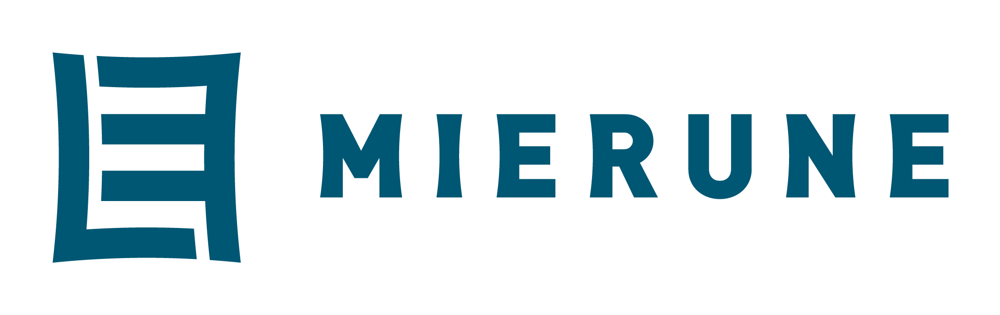
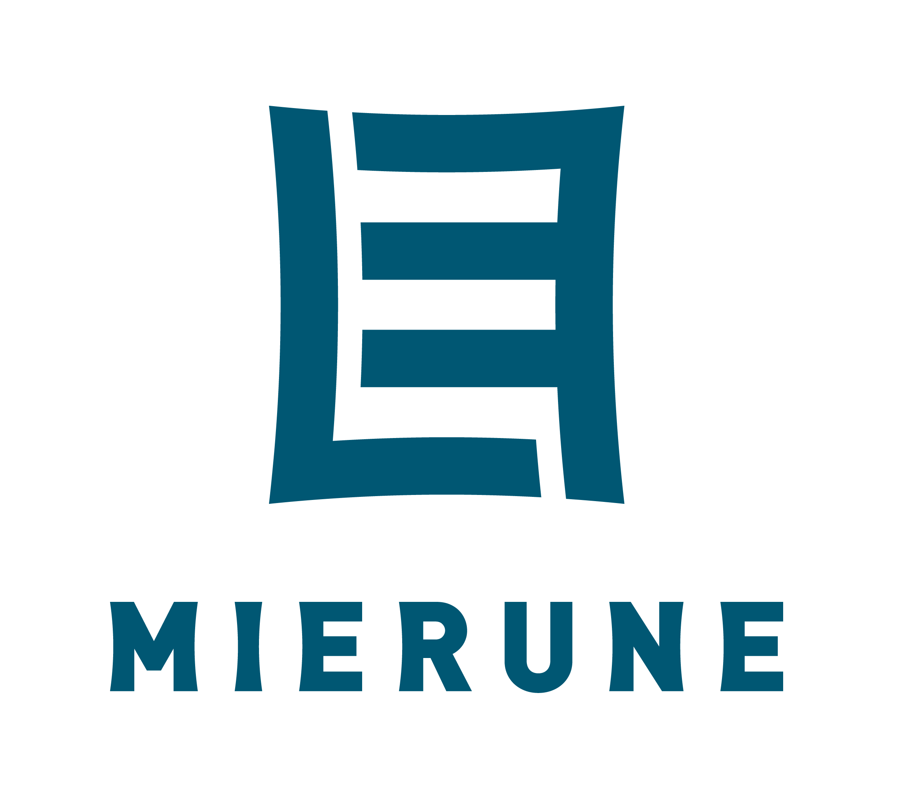
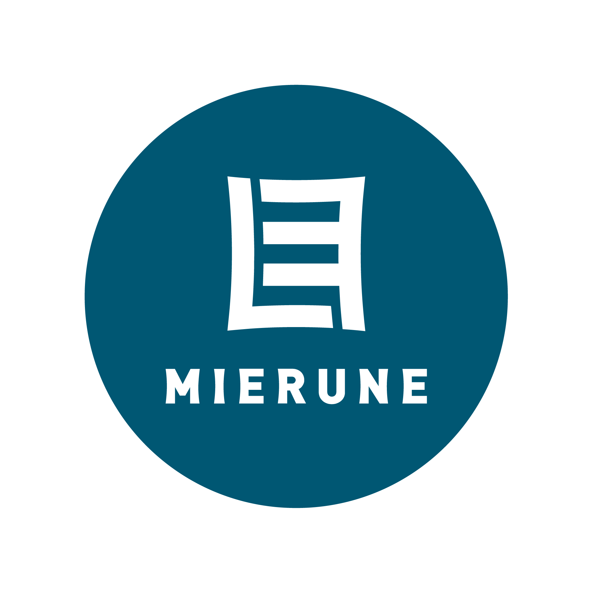

## MIERUNEロゴマークについて

MIERUNEは、様々なデータを「見える」かたちにするというミッションを持っています。  
このミッションをもとに、[IMPROVIDE](https://improvide.co.jp/)さんによって、このロゴマークが生まれました。
ロゴでは、漢字の「目」をモチーフとし「見る」ことを表しています。また、「目」だけでなく、「M」や「E」といった多方面からの解釈も想起させるデザインです。  
ロゴデータは、[CC BY-ND 4.0](https://creativecommons.org/licenses/by-nd/4.0/deed.ja)に従って、ご自由にお使いください。
ロゴの使用例については、[マニュアル](manual.pdf)にまとめましたのでこちらに沿った利用をお願いします。

  

 

