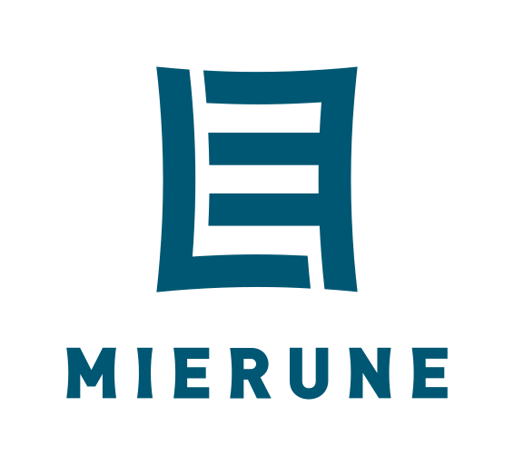

## MIERUNEロゴマークについて

MIERUNEは、様々なデータを「見える」かたちにするというミッションを持っています。このミッションをもとに、[IMPROVIDE](https://improvide.co.jp/)さんによって、このロゴマークが生まれました。

ロゴは、漢字の「目」をモチーフとし「見る」ことを表しています。また、「目」だけでなく、「M」や「E」といった多方面からの解釈も想起させるデザインになっています。

ロゴデータは、[CC BY-ND 4.0](https://creativecommons.org/licenses/by-nd/4.0/deed.ja)（クリエイティブ・コモンズ 表示 - 改変禁止 4.0 国際）ランセンスに従ってご自由にお使い頂けます。ロゴの使用例を[マニュアル](manual.pdf)にまとめましたので、こちらに沿った利用をお願いします。

  
 

